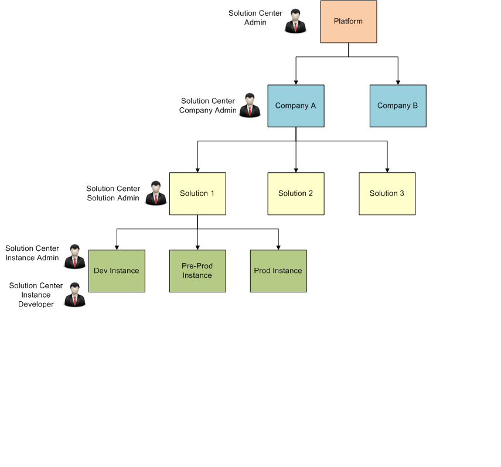

# Solution Center Roles
The Developer Portal Solution Center has its own set of associated roles, and when a user is granted a role, they gain access to specific features for that application. Each role will be described in detail below, but there are a few general traits shared across roles that are worth noting:

* Multiple roles can be assigned to a single user
Example- Roles are cumulative; a single user can be a CCA Security Administrator, a Solution Center Company Administrator, a Solution Center User, and a Messaging Tenant Admin all at the same time.

## Role Map
This section illustrates the concept of the solution center roles using an example. Some roles implicitly have access to the features of lower-level roles beneath them. The Solution Center Administrator has access to every solution and instance on the platform, even if they have not explicitly been granted the Solution Administrator or Instance Administrator roles. In the role map below, there are two companies on the platform - Company A and Company B. The Solution Center Admin role has access to all the features in Company A and Company B. Some roles must be granted against the entity which they are intended to protect. The Solution Center Company Admin has access to all the features within Company A. In other words, the Solution Center Company Admin has access to all the solutions under Company A - Solution 1, Solution 2, and Solution 3. The Solution Center Solution Admin role has administrative rights to just one particular solution and all the instances under that solution. This role has access to Solution 1, and all the instances - Dev Instance, Pre-Prod Instance, and Prod Instance. The Solution Center Instance Admin and the Solution Center Instance Developer roles have administrative rights to only the instance they're given access to. They have access to Dev Instance.

